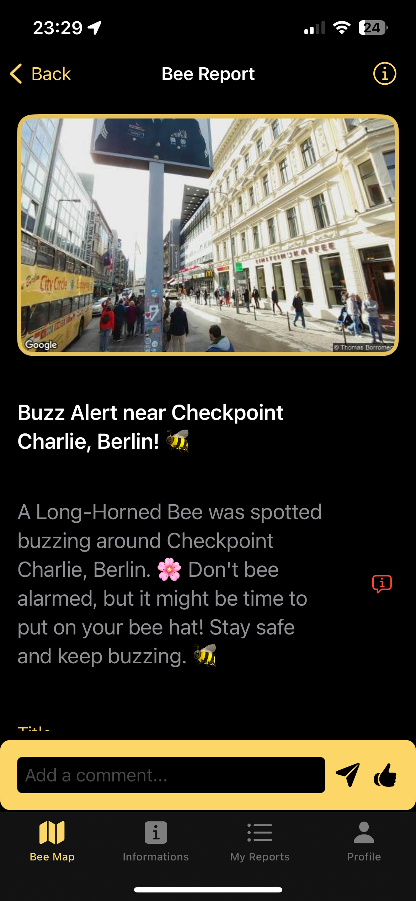
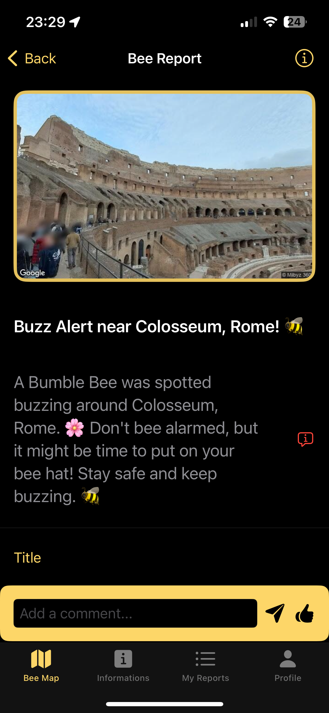
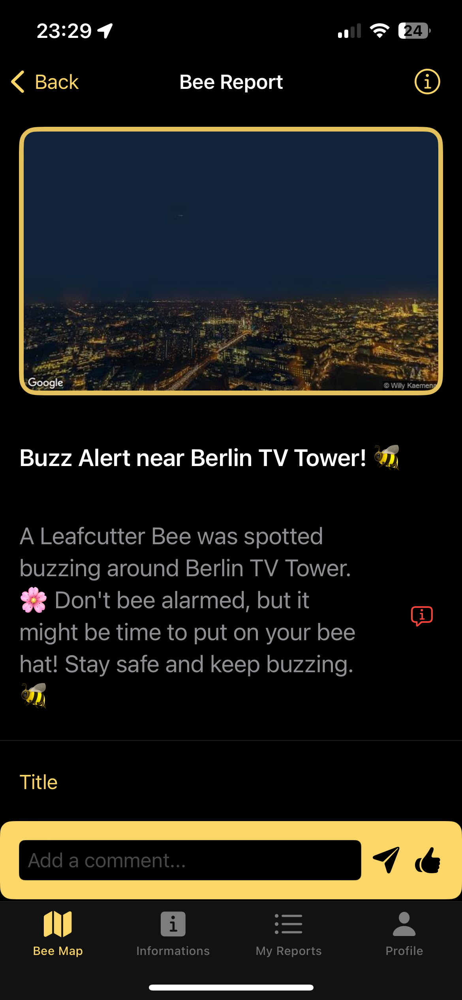
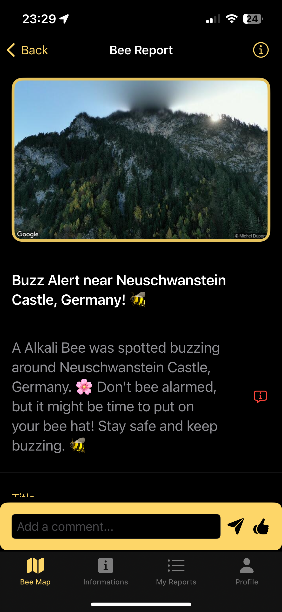
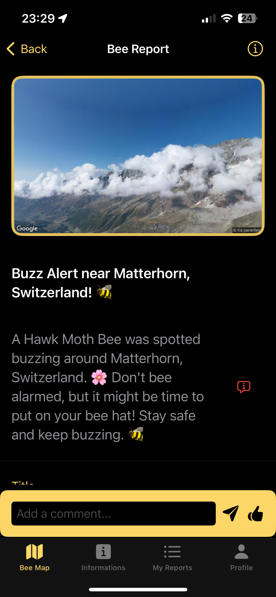
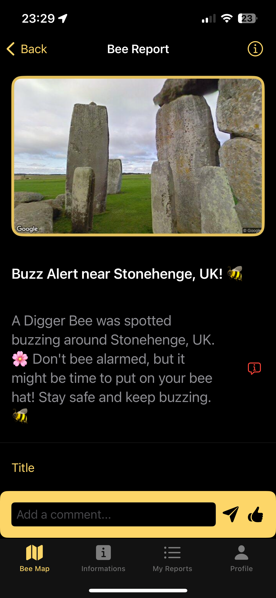
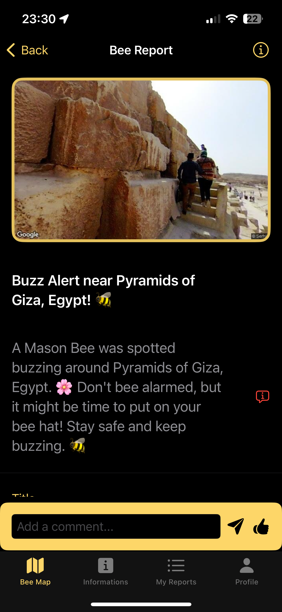
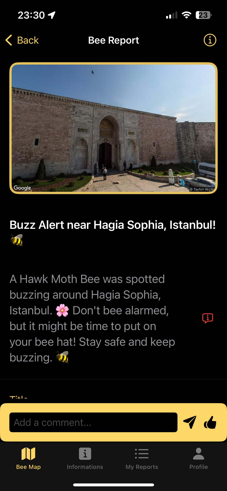

# Bee-Spotter

**Bee-Spotter** - Bee aware, Bee safe!

Bee-Spotter is an app that allows users to report and view bee sightings on a map based on their location. With real-time reporting and automatic deletion after 2 hours, users receive the most up-to-date information about bee activity around them and worldwide.

## Who Is It For?
Bee-Spotter is ideal for:
* Nature enthusiasts and environmentalists interested in tracking bee populations.
* Individuals with bee allergies who need to avoid areas with high bee activity.
* Citizen scientists contributing to research efforts by reporting bee sightings.

## App Overview
Bee-Spotter’s goal is to raise awareness about bee activity, contribute to citizen science, and keep users informed about bee populations. The app also helps users avoid areas with high bee activity if they are concerned about allergies.

## Design

  
  
  

  
  
  

## Features

### Core Features
* **User Location Tracking and Bee Sighting Reporting**: Real-time tracking of user location with the option to report bee sightings. Reports are tied directly to the user’s current location and cannot be manually altered, ensuring transparency and preventing fake reports.
* **Map Display of Bee Reports**: View reported bee sightings on a map based on proximity to the user’s location. Users can also freely explore the map to check bee reports worldwide.
* **Community Interaction**: Users can comment on reports, like them, and engage with the bee-spotting community.
* **Automatic Report Deletion**: Reports are automatically deleted 2 hours after submission to ensure up-to-date information.
* **Manual Report Deletion**: Users can manually delete their own reports at any time.
* **Notifications**: Users receive notifications while the app is open if someone interacts with their reports.
* **User Profile and Sighting History**: View and manage your profile, including past bee sightings.
* **language support**: Bee_Spotter support support the following languages: English Arabic as well as German.

### Additional Features
* **Home Screen Widgets**: Display facts about bees directly on the home screen.
* **Enhanced Information View**:
    * **Distance-Based Bee Statistics**: View statistics on bee activity within various distances from your location (5 meters to 50 kilometers).
    * **Bee Distribution Charts**: Visualize how bee sightings are distributed across different distances.
    * **Global Bee Statistics**: See worldwide statistics, including the total number of bee reports, types of bees reported, and their frequencies.
* **Comprehensive Bee Species Information**:
    * **Bee Encyclopedia**: Learn about different bee species, including their lifespan, diet, ecological impact, and more.
    * **Species Details**: View in-depth information for each species, including images, habitats, and behavior insights.
* **My Reports View**:
    * **Manage Your Reports**: Easily view, edit, or delete your reports, or add new ones.
    * **Detailed Report Information**: Each report includes a title, description, bee type, street view image, who submitted the report, and more.
    * **Comments and Interactions**: Engage with other users by commenting on or liking reports.
* **Main View**:
    * **Street-Level Zoom**: Zoom in closely to explore reported areas with street-level detail.
* **Detailed Report View**:
    * **Report Information**: Includes the report title, description, bee type, street view image, submitter details, and more.
    * **Auto-Deletion Countdown**: Timer showing when the report will be deleted (2 hours).
    * **Interaction Features**: Commenting, liking, and notifications for new interactions.
    * **Location Data**: Includes the address and precise coordinates of the sighting.
* **Profile Customization**: Update your profile picture, username color, and other settings.
* **SOS Profile**: Quick access to emergency contacts or information in case of a bee-related incident.
* **Report History**: Access a list of all reports you’ve submitted.

## sights

  
  
  
  

## Technical Structure

### Project Architecture
Bee-Spotter is built using the MVVM (Model-View-ViewModel) design pattern, ensuring clean separation of logic and UI components.

### Data Storage
Bee-Spotter uses Firebase for storing reports in real-time. Reports are automatically deleted 2 hours after submission to maintain relevance. Users can manually delete their reports if needed. Core Data is used for local storage, allowing offline access to user profile information and report history.

### API Integrations
* **User Location Tracking**: Uses CoreLocation to track and update user location in real-time.
* **Google Maps API**: Integrated for map display and location-based imagery (StreetView).
* **Firebase Firestore**: Handles real-time storage, retrieval, and deletion of bee sighting data.

### Third-Party Frameworks
* **Firebase**: For real-time data storage, user authentication, and in-app notifications.
* **MapKit and Google Maps**: Used for map functionality and location services.
* **Swift Packages**: For additional UI components, charts, and utility functions.

### Future Expansion
Bee-Spotter’s roadmap includes:
* **Advanced Data Analytics**: Improved insights into bee activity trends and distribution.
* **Research Collaboration**: Partnering with environmental organizations and researchers for scientific studies and data sharing.

## Conclusion
Bee-Spotter is designed to be a comprehensive tool for tracking bee activity, contributing to citizen science, and providing real-time information for safety and awareness. With its combination of detailed data, easy reporting, and community engagement, the app is a valuable resource for both casual users and dedicated nature enthusiasts.

## sights

  
  
  
  
  
---

## Arabic Version

---

# Bee-Spotter

**Bee-Spotter** - كن واعيًا، كن آمنًا!

Bee-Spotter هو تطبيق يتيح للمستخدمين الإبلاغ عن مشاهدات النحل وعرضها على خريطة بناءً على موقعهم. مع الإبلاغ في الوقت الفعلي والحذف التلقائي بعد ساعتين، يحصل المستخدمون على أحدث المعلومات حول نشاط النحل من حولهم وفي جميع أنحاء العالم.

## من هو مخصص له؟
Bee-Spotter مثالي لـ:
* محبي الطبيعة والبيئة المهتمين بتتبع تجمعات النحل.
* الأشخاص الذين يعانون من حساسية النحل ويحتاجون إلى تجنب المناطق ذات النشاط العالي للنحل.
* العلماء المواطنين الذين يساهمون في جهود البحث من خلال الإبلاغ عن مشاهدات النحل.

## نظرة عامة على التطبيق
هدف Bee-Spotter هو زيادة الوعي بنشاط النحل، والمساهمة في العلم الجماهيري، وإبقاء المستخدمين على اطلاع حول تجمعات النحل. كما يساعد التطبيق المستخدمين على تجنب المناطق ذات النشاط العالي للنحل إذا كانوا قلقين بشأن الحساسية.

## التصميم

  
  
  

  
  
  

## الميزات

### الميزات الأساسية
* **تتبع الموقع والإبلاغ عن مشاهدات النحل**: تتبع الموقع في الوقت الفعلي مع خيار الإبلاغ عن مشاهدات النحل. التقارير مرتبطة مباشرة بموقع المستخدم الحالي ولا يمكن تعديلها يدويًا، مما يضمن الشفافية ويمنع التقارير المزيفة.
* **عرض التقارير على الخريطة**: عرض مشاهدات النحل المُبلغ عنها على خريطة بناءً على قربها من موقع المستخدم. يمكن للمستخدمين أيضًا استكشاف الخريطة بحرية للتحقق من تقارير النحل في جميع أنحاء العالم.
* **التفاعل المجتمعي**: يمكن للمستخدمين التعليق على التقارير، الإعجاب بها، والتفاعل مع مجتمع مراقبي النحل.
* **الحذف التلقائي للتقارير**: يتم حذف التقارير تلقائيًا بعد ساعتين من تقديمها لضمان الحصول على معلومات محدثة.
* **حذف التقارير يدويًا**: يمكن للمستخدمين حذف تقاريرهم يدويًا في أي وقت.
* **الإشعارات**: يتلقى المستخدمون إشعارات عند التفاعل مع تقاريرهم بينما يكون التطبيق مفتوحًا.
* **الملف الشخصي وسجل المشاهدات**: عرض وإدارة ملفك الشخصي، بما في ذلك مشاهدات النحل السابقة.
* **دعم اللغات**: يدعم تطبيق بي-سبوتر اللغات التالية: الإنجليزية، العربية، والألمانية.

### ميزات إضافية
* **ودجت الشاشة الرئيسية**: عرض معلومات حول النحل مباشرة على الشاشة الرئيسية.
* **عرض معلومات محسّن**:
    * **إحصائيات نشاط النحل حسب المسافة**: عرض إحصائيات حول نشاط النحل ضمن مسافات مختلفة من موقعك (من 5 أمتار إلى 50 كيلومترًا).
    * **رسوم بيانية لتوزيع النحل**: تصور كيفية توزيع مشاهدات النحل عبر مسافات مختلفة.
    * **إحصائيات النحل العالمية**: عرض إحصائيات عالمية، بما في ذلك إجمالي عدد تقارير النحل، وأنواع النحل المبلغ عنها، وتكرارها.
* **معلومات شاملة عن أنواع النحل**:
    * **موسوعة النحل**: تعلم حول أنواع النحل المختلفة، بما في ذلك دورة حياتها، غذائها، وتأثيرها البيئي.
    * **تفاصيل الأنواع**: عرض معلومات متعمقة لكل نوع، بما في ذلك الصور، المواطن، والرؤى السلوكية.
* **عرض تقاريري**:
    * **إدارة تقاريرك**: عرض، تحرير، أو حذف تقاريرك، أو إضافة تقارير جديدة بسهولة.
    * **معلومات التقرير التفصيلية**: يشمل كل تقرير عنوانًا، وصفًا، نوع النحل، صورة عرض الشارع، من قدم التقرير، وأكثر.
    * **التعليقات والتفاعلات**: التفاعل مع المستخدمين الآخرين بالتعليق على التقارير أو الإعجاب بها.
* **العرض الرئيسي**:
    * **التكبير على مستوى الشارع**: تكبير لاستكشاف المناطق المُبلغ عنها بتفاصيل على مستوى الشارع.
* **عرض التقرير التفصيلي**:
    * **معلومات التقرير**: يتضمن عنوان التقرير، الوصف، نوع النحل، صورة عرض الشارع، تفاصيل مقدم التقرير، وأكثر.
    * **مؤقت الحذف التلقائي**: يظهر العد التنازلي لحذف التقرير (ساعتين).
    * **ميزات التفاعل**: التعليق، الإعجاب، والإشعارات عند وجود تفاعلات جديدة.
    * **بيانات الموقع**: يتضمن العنوان والإحداثيات الدقيقة للرؤية.
* **تخصيص الملف الشخصي**: تحديث صورة الملف الشخصي، لون اسم المستخدم، وإعدادات أخرى.
* **ملف الطوارئ**: وصول سريع لجهات الاتصال الطارئة أو المعلومات في حالة حدوث حادث مرتبط بالنحل.
* **سجل التقارير**: الوصول إلى قائمة بجميع التقارير التي قمت بتقديمها.

  
  
  
  

## الهيكل التقني

### هيكل المشروع
Bee-Spotter مبني باستخدام نمط تصميم MVVM (Model-View-ViewModel)، مما يضمن فصلًا نظيفًا بين المنطق ومكونات واجهة المستخدم.

### تخزين البيانات
يستخدم Bee-Spotter Firebase لتخزين التقارير في الوقت الفعلي. يتم حذف التقارير تلقائيًا بعد ساعتين من تقديمها لضمان الصلة. يمكن للمستخدمين حذف تقاريرهم يدويًا عند الحاجة. يتم استخدام Core Data للتخزين المحلي، مما يسمح بالوصول دون اتصال إلى معلومات الملف الشخصي وسجل التقارير.

### تكاملات API
* **تتبع الموقع**: يستخدم CoreLocation لتتبع وتحديث موقع المستخدم في الوقت الفعلي.
* **Google Maps API**: مدمجة لعرض الخرائط والصور المستندة إلى الموقع (StreetView).
* **Firebase Firestore**: يدير تخزين البيانات واسترجاعها وحذفها في الوقت الفعلي لتقارير مشاهدات النحل.

### أطر العمل الخارجية
* **Firebase**: للتخزين الفوري للبيانات، المصادقة، والإشعارات داخل التطبيق.
* **MapKit وGoogle Maps**: تُستخدم لوظائف الخرائط وخدمات الموقع.
* **Swift Packages**: لمكونات واجهة المستخدم الإضافية، المخططات، والوظائف المساعدة.

### التوسع المستقبلي
تشمل خارطة الطريق الخاصة بـ Bee-Spotter:
* **تحليلات بيانات متقدمة**: تحسين الرؤى حول اتجاهات وتوزيع نشاط النحل.
* **التعاون في البحث**: التعاون مع منظمات بيئية وباحثين للدراسات العلمية ومشاركة البيانات.

  
  
  
  

## الخاتمة
تم تصميم Bee-Spotter ليكون أداة شاملة لتتبع نشاط النحل، المساهمة في العلم الجماهيري، وتوفير معلومات في الوقت الفعلي للسلامة والوعي. بفضل مزيجها من البيانات التفصيلية، والتقارير السهلة، والتفاعل المجتمعي، تعد التطبيق مصدرًا قيمًا لكل من المستخدمين العاديين وعشاق الطبيعة المتفانين.

---

## German Version

---

# Bee-Spotter

**Bee-Spotter** - Sei aufmerksam, sei sicher!

Bee-Spotter ist eine App, die es Benutzern ermöglicht, Bienensichtungen basierend auf ihrem Standort auf einer Karte zu melden und anzuzeigen. Mit Echtzeitmeldungen und automatischem Löschen nach 2 Stunden erhalten Benutzer die aktuellsten Informationen über Bienenaktivität in ihrer Umgebung und weltweit.

## Für wen ist es gedacht?
Bee-Spotter ist ideal für:
* Naturliebhaber und Umweltschützer, die an der Verfolgung von Bienenpopulationen interessiert sind.
* Personen mit Bienenallergien, die Bereiche mit hoher Bienenaktivität meiden müssen.
* Bürgerwissenschaftler, die durch das Melden von Bienensichtungen zu Forschungsbemühungen beitragen.

## App-Übersicht
Das Ziel von Bee-Spotter ist es, das Bewusstsein für Bienenaktivität zu schärfen, zur Bürgerwissenschaft beizutragen und Benutzer über Bienenpopulationen zu informieren. Die App hilft Benutzern auch, Bereiche mit hoher Bienenaktivität zu vermeiden, falls sie sich wegen Allergien Sorgen machen.

## Design

  
  
  

  
  
  

## Funktionen

### Kernfunktionen
* **Standortverfolgung und Bienenmeldungen**: Echtzeit-Standortverfolgung mit der Option, Bienensichtungen zu melden. Berichte sind direkt an den aktuellen Standort des Benutzers gebunden und können nicht manuell geändert werden, was Transparenz gewährleistet und falsche Berichte verhindert.
* **Kartendarstellung der Bienenmeldungen**: Zeigt gemeldete Bienenbeobachtungen auf einer Karte basierend auf der Nähe zum Standort des Benutzers an. Benutzer können auch die Karte frei erkunden, um Bienenmeldungen weltweit zu überprüfen.
* **Gemeinschaftsinteraktion**: Benutzer können Berichte kommentieren, liken und mit der Bienen-Community interagieren.
* **Automatisches Löschen von Meldungen**: Meldungen werden automatisch 2 Stunden nach der Übermittlung gelöscht, um aktuelle Informationen sicherzustellen.
* **Manuelles Löschen von Meldungen**: Benutzer können ihre eigenen Meldungen jederzeit manuell löschen.
* **Benachrichtigungen**: Benutzer erhalten Benachrichtigungen, wenn die App geöffnet ist, falls jemand mit ihren Meldungen interagiert.
* **Benutzerprofil und Sichtungshistorie**: Anzeigen und Verwalten Ihres Profils, einschließlich früherer Bienenbeobachtungen.
* **Sprachunterstützung**: Bee-Spotter unterstützt die folgenden Sprachen: Englisch, Arabisch und Deutsch.

### Zusätzliche Funktionen
* **Startbildschirm-Widgets**: Zeigt Fakten über Bienen direkt auf dem Startbildschirm an.
* **Erweiterte Informationsansicht**:
    * **Entfernungsgestützte Bienenstatistiken**: Zeigt Statistiken zur Bienenaktivität in verschiedenen Entfernungen von Ihrem Standort (5 Meter bis 50 Kilometer).
    * **Bienenverteilungsdiagramme**: Visualisiert, wie sich Bienenbeobachtungen über verschiedene Entfernungen verteilen.
    * **Globale Bienenstatistiken**: Zeigt weltweite Statistiken, einschließlich der Gesamtzahl der Bienenmeldungen, der gemeldeten Bienentypen und deren Häufigkeit.
* **Umfassende Informationen zu Bienenarten**:
    * **Bienen-Enzyklopädie**: Lernen Sie verschiedene Bienenarten kennen, einschließlich ihrer Lebensdauer, Ernährung, ökologischen Auswirkungen und mehr.
    * **Artendetails**: Zeigt detaillierte Informationen zu jeder Art an, einschließlich Bilder, Lebensräume und Verhaltensweisen.
* **Meine Berichte-Ansicht**:
    * **Verwalten Ihrer Meldungen**: Anzeigen, Bearbeiten oder Löschen Ihrer Meldungen oder Hinzufügen neuer Meldungen.
    * **Detaillierte Berichtsinformationen**: Jeder Bericht enthält einen Titel, eine Beschreibung, den Bienen-Typ, ein Straßenbild, Informationen zum Einreicher und mehr.
    * **Kommentare und Interaktionen**: Interagieren Sie mit anderen Benutzern, indem Sie Berichte kommentieren oder liken.
* **Hauptansicht**:
    * **Straßen-Level-Zoom**: Nah heranzoomen, um gemeldete Bereiche mit Straßendetails zu erkunden.
* **Detaillierte Berichtsansicht**:
    * **Berichtsinformationen**: Beinhaltet den Berichtstitel, die Beschreibung, den Bienen-Typ, das Straßenbild, Einreicherdetails und mehr.
    * **Countdown für das automatische Löschen**: Zeigt den Timer an, wann der Bericht gelöscht wird (2 Stunden).
    * **Interaktionsfunktionen**: Kommentieren, liken und Benachrichtigungen für neue Interaktionen.
    * **Standortdaten**: Beinhaltet die Adresse und die genauen Koordinaten der Sichtung.
* **Profilanpassung**: Aktualisieren Sie Ihr Profilbild, die Farbe des Benutzernamens und andere Einstellungen.
* **SOS-Profil**: Schneller Zugriff auf Notfallkontakte oder Informationen im Falle eines bienenbezogenen Vorfalls.
* **Berichtshistorie**: Zugriff auf eine Liste aller eingereichten Berichte.

## Technische Struktur

  
  
  
  

### Projektarchitektur
Bee-Spotter wird unter Verwendung des MVVM (Model-View-ViewModel) Design Patterns entwickelt, das eine saubere Trennung von Logik und UI-Komponenten gewährleistet.

### Datenspeicherung
Bee-Spotter verwendet Firebase zur Speicherung von Berichten in Echtzeit. Berichte werden automatisch 2 Stunden nach der Übermittlung gelöscht, um die Relevanz zu gewährleisten. Benutzer können ihre Berichte bei Bedarf manuell löschen. Core Data wird für die lokale Speicherung verwendet, wodurch der Offline-Zugriff auf Benutzerprofilinformationen und Berichtshistorie ermöglicht wird.

### API-Integrationen
* **Standortverfolgung**: Verwendet CoreLocation, um den Standort des Benutzers in Echtzeit zu verfolgen und zu aktualisieren.
* **Google Maps API**: Integriert für die Kartendarstellung und standortbasierte Bilder (StreetView).
* **Firebase Firestore**: Verwaltet die Echtzeitspeicherung, den Abruf und das Löschen von Bienensichtungsdaten.

### Drittanbieter-Frameworks
* **Firebase**: Für die Echtzeitspeicherung von Daten, Benutzerauthentifizierung und In-App-Benachrichtigungen.
* **MapKit und Google Maps**: Für Kartendienste und Standortdienste.
* **Swift Packages**: Für zusätzliche UI-Komponenten, Diagramme und Dienstprogramme.

### Zukünftige Erweiterungen
Der Fahrplan von Bee-Spotter umfasst:
* **Erweiterte Datenanalyse**: Verbesserte Einblicke in Bienenaktivitätstrends und -verteilung.
* **Forschungszusammenarbeit**: Zusammenarbeit mit Umweltorganisationen und Forschern für wissenschaftliche Studien und Datenaustausch.

## sights

  
  
  
  
  
## Fazit
Bee-Spotter ist als umfassendes Werkzeug konzipiert, um Bienenaktivität zu verfolgen, zur Bürgerwissenschaft beizutragen und Echtzeitinformationen für Sicherheit und Bewusstsein bereitzustellen. Mit seiner Kombination aus detaillierten Daten, einfacher Meldung und Community-Engagement ist die App eine wertvolle Ressource für sowohl Gelegenheitsbenutzer als auch engagierte Naturliebhaber.
